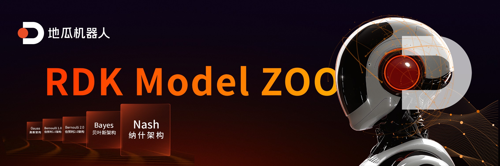
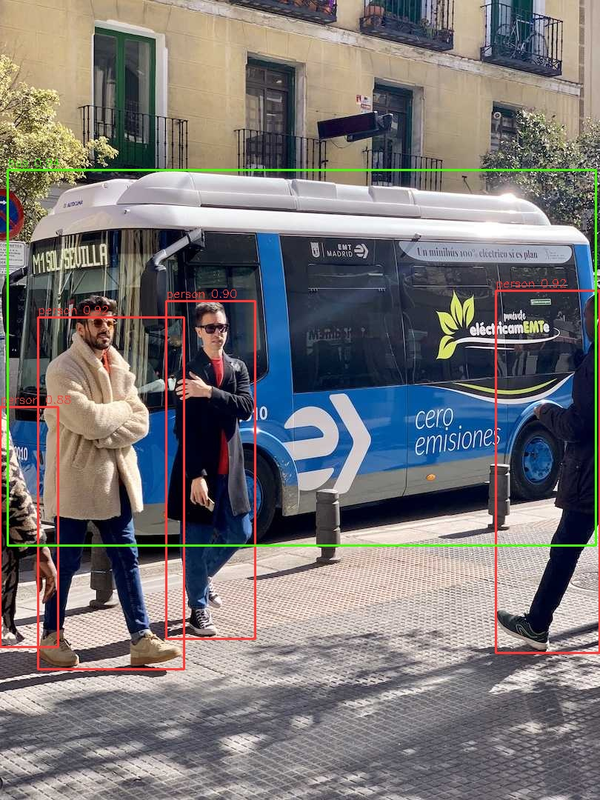

<div align="center">
  
</div>

<div align="center">
  <h1 align="center">RDK Model Zoo</h1>
  <p align="center">
    <b>Out-of-the-Box AI Model Deployment Pipelines and Full-Link Conversion Tutorials Based on D-Robotics BPU</b>
  </p>
</div>

<div align="center">

**English** | [简体中文](./README_cn.md)

<p align="center">
  <a href="https://github.com/D-Robotics/rdk_model_zoo/stargazers"></a>
  <a href="https://github.com/D-Robotics/rdk_model_zoo/network/members"></a>
  <a href="https://github.com/D-Robotics/rdk_model_zoo/pulls"></a>
  <a href="https://github.com/D-Robotics/rdk_model_zoo/tree/rdk_x5/LICENSE"></a>
  <a href="https://developer.d-robotics.cc"></a>
</p>

</div>

## Introduction

> **Mission**: Dedicated to providing D-Robotics developers with extreme performance, out-of-the-box, and full-scenario AI deployment validation experiences.

This repository is the official collection of BPU model examples and tools (Model Zoo) provided by D-Robotics. It is oriented towards AI model deployment and application development on BPU (Brain Processing Unit), helping developers to **quickly get started with BPU** and **fast-track model inference workflows**.

The repository includes BPU-ready models across multiple AI domains and provides complete reference implementations from **Original Model (PyTorch/ONNX) -> Fixed-point Quantization -> Inference Execution -> Result Parsing -> Example Validation**, helping users understand and utilize BPU capabilities at minimal cost.

### Core Value

- 🚀 **Quick BPU Adoption**: Provides out-of-the-box inference pipelines to help users complete BPU inference validation and performance evaluation in the shortest time.
- 🧩 **Complete End-to-End Examples**: Covers the entire process from algorithm export and fixed-point quantization to efficient on-board execution (`.bin` / `.hbm`). Includes model loading, preprocessing, BPU inference execution, post-processing, and result visualization.
- 📐 **Standardized Design & Documentation**: Provides unified directory structures and sample code specifications, supporting Python (`hbm_runtime`) and C/C++ interfaces for easy understanding, secondary development, and reduced integration/maintenance costs.
- 🌐 **Full Scenario Coverage**: Covers classification, detection, segmentation, pose estimation, OCR, and multi-modal models.

### Hardware & System Support

This repository uses hardware-specific branches to keep maintained samples, legacy demos, and board-specific documents clearly separated. The current `rdk_x5` branch is the primary delivery branch for RDK X5. The previous `main` branch has been renamed to `rdk_x5_legacy` and is kept only as the historical archive branch.

| Target Hardware | Branch | Description |
| :--- | :--- | :--- |
| RDK X5 | [`rdk_x5`](https://github.com/D-Robotics/rdk_model_zoo/tree/rdk_x5) | Primary delivery branch for RDK X5. Recommended system version: RDK OS >= 3.5.0, based on Ubuntu 22.04 aarch64 and TROS-Humble. |
| RDK X5 legacy demos | [`rdk_x5_legacy`](https://github.com/D-Robotics/rdk_model_zoo/tree/rdk_x5_legacy) | Historical archive branch for the previous RDK X5 demos. Use it only when you need to reference legacy demo content. |
| RDK X3 | [`rdk_x3`](https://github.com/D-Robotics/rdk_model_zoo/tree/rdk_x3) | Branch for RDK X3 devices. |
| RDK S series | [`rdk_s`](https://github.com/D-Robotics/rdk_model_zoo/tree/rdk_s) | Branch for RDK S series boards. Historical archived demos for RDK S series boards are kept in [RDK Model Zoo S](https://github.com/d-Robotics/rdk_model_zoo_s). |

---

## Directory Structure

<details>
<summary><b>Click to expand project directory architecture</b></summary>

<br>

```bash
rdk_model_zoo/
|-- samples/
|   |-- vision/
|   |   |-- clip/
|   |   |-- convnext/
|   |   |-- edgenext/
|   |   |-- efficientformer/
|   |   |-- efficientformerv2/
|   |   |-- efficientnet/
|   |   |-- efficientvit/
|   |   |-- fasternet/
|   |   |-- fastvit/
|   |   |-- fcos/
|   |   |-- googlenet/
|   |   |-- lprnet/
|   |   |-- mobilenetv1/
|   |   |-- mobilenetv2/
|   |   |-- mobilenetv3/
|   |   |-- mobilenetv4/
|   |   |-- mobileone/
|   |   |-- modnet/
|   |   |-- paddleocr/
|   |   |-- repghost/
|   |   |-- repvgg/
|   |   |-- repvit/
|   |   |-- resnet/
|   |   |-- resnext/
|   |   |-- ultralytics_yolo/
|   |   |-- ultralytics_yolo26/
|   |   |-- vargconvnet/
|   |   |-- yoloe/
|   |   |-- yolov5/
|   |   `-- yoloworld/
|-- docs/                  # Project guidelines and reference documentation
|-- datasets/              # Sample datasets and download scripts
|-- tros/                  # TROS integration guides and examples
|-- utils/                 # Shared C++ / Python utilities
```
</details>

---

## Quick Start

1. **Check system version**: Ensure the target board is running `RDK OS >= 3.5.0`.
2. **Connect hardware**: Ensure your RDK board is powered and network-connected. SSH or VSCode Remote SSH is recommended.
3. **Read the model README first**: Always open the target directory `README.md` before running commands.
4. **Run the Ultralytics YOLO11x detection sample**:

```bash
cd samples/vision/ultralytics_yolo/model
wget -nc https://archive.d-robotics.cc/downloads/rdk_model_zoo/rdk_x5/ultralytics_YOLO/yolo11x_detect_bayese_640x640_nv12.bin

cd ../runtime/python
python3 main.py \
  --task detect \
  --model-path ../../model/yolo11x_detect_bayese_640x640_nv12.bin \
  --test-img ../../../../../datasets/coco/assets/bus.jpg \
  --img-save-path ../../test_data/inference_yolo11x.jpg
```

**Inference Result:**
<div align="center">
  
</div>

---

## Model List

| Category | Model Name | Model Path | Supported Platform | Details |
| :--- | :--- | :--- | :--- | :---: |
| Image Classification | ConvNeXt | `samples/vision/convnext` | RDK X5 | [Details](./samples/vision/convnext) |
| Image Classification | EdgeNeXt | `samples/vision/edgenext` | RDK X5 | [Details](./samples/vision/edgenext) |
| Image Classification | EfficientFormer | `samples/vision/efficientformer` | RDK X5 | [Details](./samples/vision/efficientformer) |
| Image Classification | EfficientFormerV2 | `samples/vision/efficientformerv2` | RDK X5 | [Details](./samples/vision/efficientformerv2) |
| Image Classification | EfficientNet | `samples/vision/efficientnet` | RDK X5 | [Details](./samples/vision/efficientnet) |
| Image Classification | EfficientViT | `samples/vision/efficientvit` | RDK X5 | [Details](./samples/vision/efficientvit) |
| Image Classification | FasterNet | `samples/vision/fasternet` | RDK X5 | [Details](./samples/vision/fasternet) |
| Image Classification | FastViT | `samples/vision/fastvit` | RDK X5 | [Details](./samples/vision/fastvit) |
| Image Classification | GoogLeNet | `samples/vision/googlenet` | RDK X5 | [Details](./samples/vision/googlenet) |
| Image Classification | MobileNetV1 | `samples/vision/mobilenetv1` | RDK X5 | [Details](./samples/vision/mobilenetv1) |
| Image Classification | MobileNetV2 | `samples/vision/mobilenetv2` | RDK X5 | [Details](./samples/vision/mobilenetv2) |
| Image Classification | MobileNetV3 | `samples/vision/mobilenetv3` | RDK X5 | [Details](./samples/vision/mobilenetv3) |
| Image Classification | MobileNetV4 | `samples/vision/mobilenetv4` | RDK X5 | [Details](./samples/vision/mobilenetv4) |
| Image Classification | MobileOne | `samples/vision/mobileone` | RDK X5 | [Details](./samples/vision/mobileone) |
| Image Classification | RepGhost | `samples/vision/repghost` | RDK X5 | [Details](./samples/vision/repghost) |
| Image Classification | RepVGG | `samples/vision/repvgg` | RDK X5 | [Details](./samples/vision/repvgg) |
| Image Classification | RepViT | `samples/vision/repvit` | RDK X5 | [Details](./samples/vision/repvit) |
| Image Classification | ResNet | `samples/vision/resnet` | RDK X5 | [Details](./samples/vision/resnet) |
| Image Classification | ResNeXt | `samples/vision/resnext` | RDK X5 | [Details](./samples/vision/resnext) |
| Image Classification | VargConvNet | `samples/vision/vargconvnet` | RDK X5 | [Details](./samples/vision/vargconvnet) |
| Object Detection | FCOS | `samples/vision/fcos` | RDK X5 | [Details](./samples/vision/fcos) |
| Object Detection | YOLOv5 | `samples/vision/yolov5` | RDK X5 | [Details](./samples/vision/yolov5) |
| Object Detection / Instance Segmentation / Pose Estimation / Image Classification | Ultralytics YOLO | `samples/vision/ultralytics_yolo` | RDK X5 | [Details](./samples/vision/ultralytics_yolo) |
| Object Detection / Instance Segmentation / Pose Estimation / Image Classification | YOLO26 | `samples/vision/ultralytics_yolo26` | RDK X5 | [Details](./samples/vision/ultralytics_yolo26) |
| Instance Segmentation | YOLOE | `samples/vision/yoloe` | RDK X5 | [Details](./samples/vision/yoloe) |
| Image Matting | MODNet | `samples/vision/modnet` | RDK X5 | [Details](./samples/vision/modnet) |
| OCR Text Detection and Recognition | PaddleOCR | `samples/vision/paddleocr` | RDK X5 | [Details](./samples/vision/paddleocr) |
| License Plate Recognition | LPRNet | `samples/vision/lprnet` | RDK X5 | [Details](./samples/vision/lprnet) |
| Image-Text Multimodal Matching | CLIP | `samples/vision/clip` | RDK X5 | [Details](./samples/vision/clip) |
| Open-Vocabulary Object Detection | YOLOWorld | `samples/vision/yoloworld` | RDK X5 | [Details](./samples/vision/yoloworld) |

## Documentation & Resources

- **Model Docs**: Each model's top-level `README.md` provides an overview and run guide.
- **Source Reference**: For code-level interface details, see **[Source Documentation](./docs/source_reference/README.md)**.
- **Guidelines**: To contribute or develop, please read the **[Model Zoo Repository Guidelines](./docs/Model_Zoo_Repository_Guidelines.md)**.
- **Toolchain Manuals**:
  - [RDK X5 Toolchain Doc](https://developer.d-robotics.cc/api/v1/fileData/x5_doc-v126cn/index.html)
  - [RDK X3 Toolchain Doc](https://developer.d-robotics.cc/api/v1/fileData/horizon_xj3_open_explorer_cn_doc/index.html)
- **Developer Forum**: [D-Robotics Developer Community](https://developer.d-robotics.cc/)
- **User Manual**: [RDK User Manual](https://developer.d-robotics.cc/information)

---

## FAQ

<details>
<summary><b>1. Model accuracy doesn't meet expectations?</b></summary>
<br>

- Ensure OpenExplorer Docker and board-side `libdnn.so` versions are up-to-date.
- Check if model export followed the structure adjustments/operator replacements required in the model's README.
- Verify cosine similarity of each output node is >= 0.999 (minimum 0.99) during quantization validation.
</details>

<details>
<summary><b>2. Inference speed doesn't meet expectations?</b></summary>
<br>

- Python API performance is lower than C/C++. For maximum performance, use C/C++.
- Benchmark data (pure forward) excludes pre/post-processing. Models with **NV12** input usually achieve peak BPU throughput.
- Ensure CPU/BPU frequency is locked to maximum.
- Check for other resource-heavy processes.
</details>

<details>
<summary><b>3. How to fix quantization precision loss?</b></summary>
<br>

- Refer to the PTQ accuracy debugging section in the platform documentation.
- If INT8 loss is severe due to model characteristics, consider Mixed Precision or QAT (Quantization-Aware Training).
</details>

<details>
<summary><b>4. Error "Can't reshape 1354752 in (1,3,640,640)"?</b></summary>
<br>

Update the resolution in `preprocess.py` to match your ONNX model's input size. Delete old calibration data and re-run the calibration script.
</details>

<details>
<summary><b>5. mAP accuracy is lower than official results (e.g., Ultralytics)?</b></summary>
<br>

- Deployment uses fixed shape and INT8 quantization, unlike dynamic shape/float official tests.
- Slight implementation differences in evaluation scripts (e.g., `pycocotools`).
- NCHW-RGB to NV12 conversion adds minimal pixel-level loss.
</details>

<details>
<summary><b>6. Does the model use CPU during inference?</b></summary>
<br>

Yes. Non-quantizable or BPU-unsupported operators **fallback** to CPU. Even for pure BPU models, input/output quantization/dequantization nodes are executed by the CPU.
</details>

---

## Community & Contribution

### Star History

[](https://star-history.com/#D-Robotics/rdk_model_zoo&Date)

We warmly welcome contributions! Please raise an issue on [GitHub Issues](https://github.com/D-Robotics/rdk_model_zoo/issues) or discuss on the [Developer Community](https://developer.d-robotics.cc/).

## License

This project is licensed under the [Apache License 2.0](./LICENSE) agreement.
