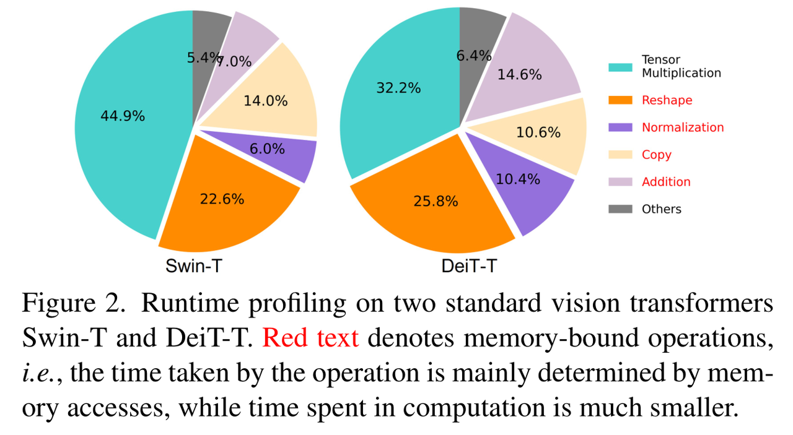
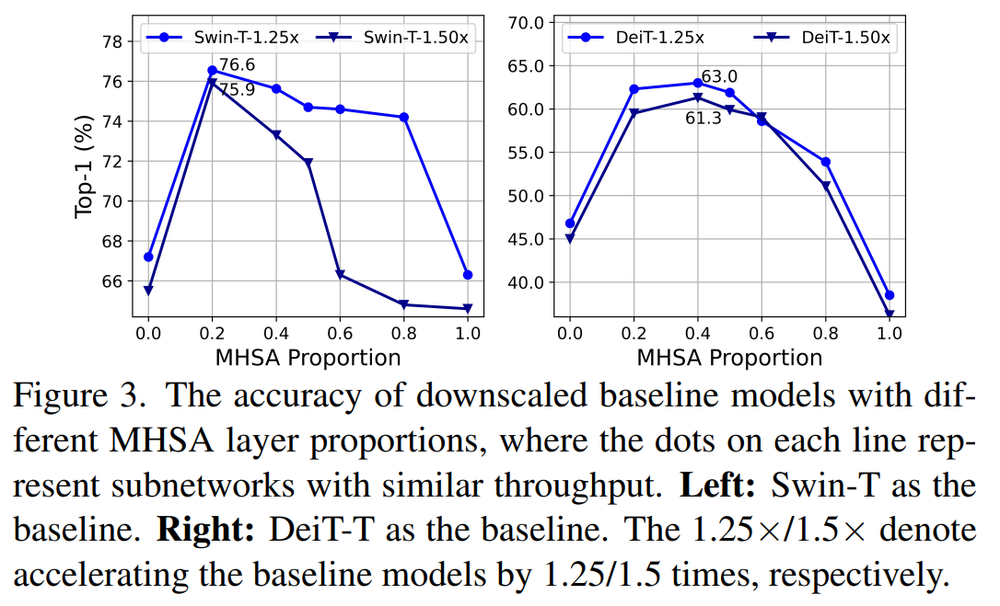
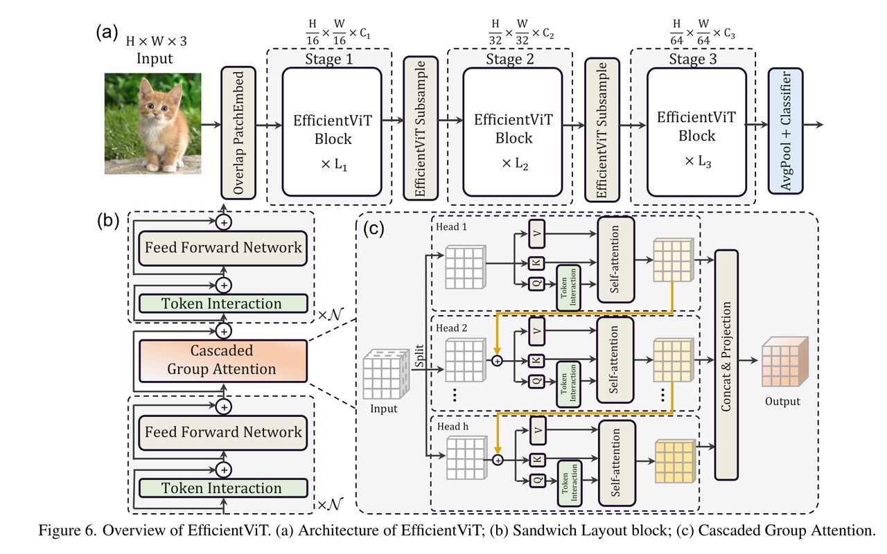

[English](./README.md) | 简体中文

# EfficientViT 模型说明

本目录给出 EfficientViT sample 在 Model Zoo 中的完整使用说明，包括算法概览、模型转换、运行时推理、模型文件管理和评测说明。

## 算法概述

EfficientViT_MSRA 是面向高效部署的轻量级视觉 Transformer 模型家族，重点优化了标准自注意力在内存访问和推理效率上的瓶颈，同时保持了较好的 ImageNet 分类精度。

- **论文**: [EfficientViT: Memory Efficient Vision Transformer with Cascaded Group Attention](https://arxiv.org/abs/2305.07027)
- **参考实现**: [microsoft/Cream - EfficientViT](https://github.com/microsoft/Cream/tree/main/EfficientViT)

### 算法功能

EfficientViT 支持以下任务：

- ImageNet 1000 类图像分类

### 算法特点

- **高效注意力设计**：降低标准 Transformer 在数据搬运上的开销。
- **级联分组注意力**：在控制部署成本的同时提升表示能力。
- **部署友好的归一化**：使用 BN 便于推理阶段融合。
- **分类输出**：输出 ImageNet-1k 的 Top-K 类别 ID 和置信度分数。





## 目录结构

```text
.
|-- conversion
|   |-- EfficientViT_MSRA_m5_config.yaml
|   |-- README.md
|   `-- README_cn.md
|-- evaluator
|   |-- README.md
|   `-- README_cn.md
|-- model
|   |-- download.sh
|   |-- README.md
|   `-- README_cn.md
|-- runtime
|   `-- python
|       |-- efficientvit.py
|       |-- main.py
|       |-- README.md
|       |-- README_cn.md
|       `-- run.sh
|-- test_data
|   |-- comparison_between_transformer_and_cnn.png
|   |-- efficientvit_msra_architecture.png
|   |-- hook.JPEG
|   |-- ImageNet_1k.json
|   |-- inference.png
|   `-- mhsa_computation.jpg
|-- README.md
`-- README_cn.md
```

## 快速体验

### Python

- Python 详细说明请参考 [runtime/python/README_cn.md](./runtime/python/README_cn.md)。
- 快速体验命令：

```bash
cd runtime/python
bash run.sh
```

## 模型转换

- 预编译 `.bin` 模型通过 [model](./model/README_cn.md) 目录提供。
- 转换说明请参考 [conversion/README_cn.md](./conversion/README_cn.md)。

## 运行时推理

本 sample 当前维护的推理路径为 Python。

- Python 推理说明：[runtime/python/README_cn.md](./runtime/python/README_cn.md)

## 评测说明

评测说明、性能数据和验证结果请参考 [evaluator/README_cn.md](./evaluator/README_cn.md)。

## 性能数据

下表给出 `RDK X5` 上发布的 EfficientViT 性能数据。

| 模型 | 输入尺寸 | 类别数 | 参数量 (M) | 浮点 Top-1 | 量化 Top-1 | 时延 (ms) | FPS |
| --- | --- | --- | --- | --- | --- | --- | --- |
| EfficientViT_m5 | 224x224 | 1000 | 12.4 | 73.75% | 72.50% | 6.34 | 174.70 |


## License

遵循 Model Zoo 顶层 License。
