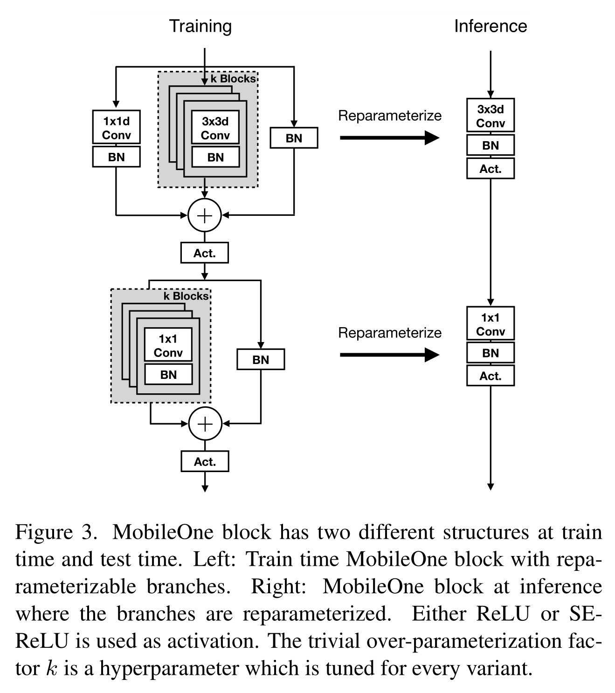
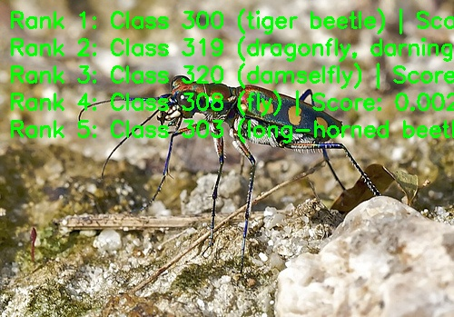

English | [简体中文](./README_cn.md)

# MobileOne Model Description

This directory provides the complete usage guide for the MobileOne sample in Model Zoo, including algorithm overview, model conversion, runtime inference, model file management, and evaluation notes.

## Algorithm Overview

MobileOne is a lightweight CNN backbone designed for low-latency deployment on edge devices. The model uses structural re-parameterization to keep training-time expressiveness while simplifying the inference-time structure.

- **Paper**: [MobileOne: An Improved One millisecond Mobile Backbone](http://arxiv.org/abs/2206.04040)
- **Reference Implementation**: [apple/ml-mobileone](https://github.com/apple/ml-mobileone)

### Algorithm Functionality

MobileOne supports the following task:

- ImageNet 1000-class image classification

### Algorithm Features

- **Structural re-parameterization**: Fuses multi-branch training blocks into an inference-friendly structure.
- **Low-latency backbone**: Targets mobile and embedded deployment with strong throughput.
- **Variant scaling**: Provides multiple published variants from `S0` to `S4`.
- **Classification output**: Produces Top-K class IDs and confidence scores for ImageNet-1k labels.



## Directory Structure

```text
.
|-- conversion
|   |-- MobileOne_S0_config.yaml
|   |-- MobileOne_S1_config.yaml
|   |-- MobileOne_S2_config.yaml
|   |-- MobileOne_S3_config.yaml
|   |-- MobileOne_S4_config.yaml
|   |-- README.md
|   `-- README_cn.md
|-- evaluator
|   |-- README.md
|   `-- README_cn.md
|-- model
|   |-- download.sh
|   |-- README.md
|   `-- README_cn.md
|-- runtime
|   `-- python
|       |-- main.py
|       |-- mobileone.py
|       |-- README.md
|       |-- README_cn.md
|       `-- run.sh
|-- test_data
|   |-- ImageNet_1k.json
|   |-- inference.png
|   |-- MobileOne_architecture.png
|   `-- tiger_beetle.JPEG
|-- README.md
`-- README_cn.md
```

## QuickStart

### Python

- Go to [runtime/python/README.md](./runtime/python/README.md) for detailed Python usage.
- For a quick experience:

```bash
cd runtime/python
bash run.sh
```

## Model Conversion

- Prebuilt `.bin` model files are provided through the [model](./model/README.md) directory.
- Conversion guidance is provided in [conversion/README.md](./conversion/README.md).

## Runtime Inference

The maintained inference path for this sample is Python.

- Python runtime guide: [runtime/python/README.md](./runtime/python/README.md)

## Evaluator

Evaluation notes, performance data, and validation summary are provided in [evaluator/README.md](./evaluator/README.md).

## Performance Data

The following table shows the published MobileOne performance on `RDK X5`.

| Model | Size | Classes | Params (M) | Float Top-1 | Quant Top-1 | Latency (ms) | FPS |
| --- | --- | --- | --- | --- | --- | --- | --- |
| MobileOne_S4 | 224x224 | 1000 | 14.8 | 78.75% | 76.50% | 4.58 | 256.52 |
| MobileOne_S3 | 224x224 | 1000 | 10.1 | 77.27% | 75.75% | 2.93 | 437.85 |
| MobileOne_S2 | 224x224 | 1000 | 7.8 | 74.75% | 71.25% | 2.11 | 653.68 |
| MobileOne_S1 | 224x224 | 1000 | 4.8 | 72.31% | 70.45% | 1.31 | 1066.95 |
| MobileOne_S0 | 224x224 | 1000 | 2.1 | 69.25% | 67.58% | 0.80 | 2453.17 |



## License

Follows the Model Zoo top-level License.
