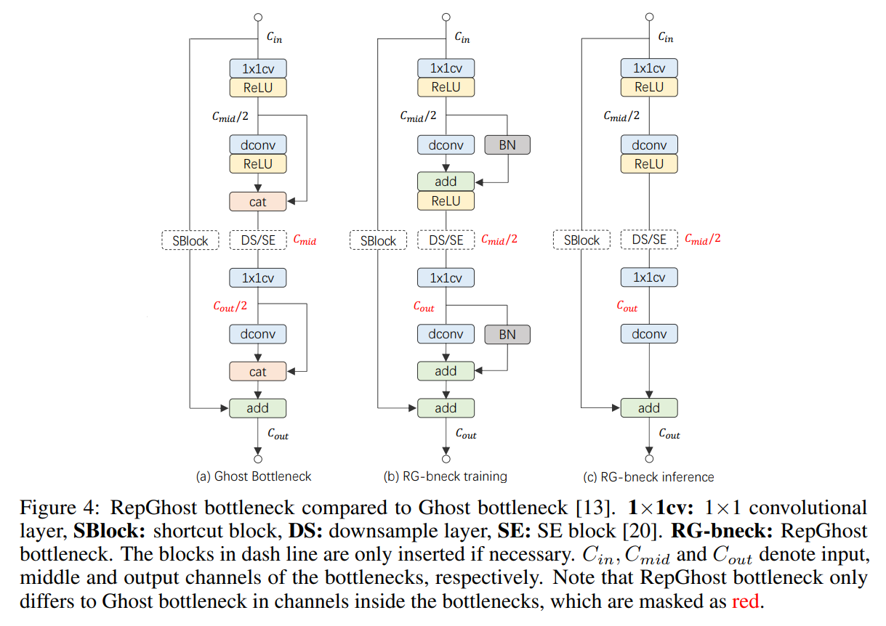
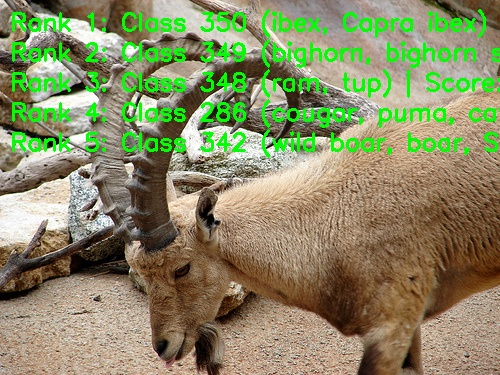

[English](./README.md) | 简体中文

# RepGhost 模型说明

本目录给出 RepGhost sample 在 Model Zoo 中的完整使用说明，包括算法概览、模型转换、运行时推理、模型文件管理和评测说明。

## 算法概述

RepGhost 是面向硬件高效部署的轻量级 CNN 模型家族，通过将特征空间中的显式特征复用转移到权重空间中的重参数化复用，减少 `Concat` 带来的硬件开销，同时保持较好的分类性能。

- **论文**: [RepGhost: A Hardware-Efficient Ghost Module via Re-parameterization](https://arxiv.org/abs/2211.06088)
- **参考实现**: [ChengpengChen/RepGhost](https://github.com/ChengpengChen/RepGhost)

### 算法功能

RepGhost 支持以下任务：

- ImageNet 1000 类图像分类

### 算法特点

- **结构重参数化**：将训练期复杂分支转换为推理期高效结构。
- **隐式特征复用**：将特征复用从特征空间迁移到权重空间，避免高成本 `Concat`。
- **硬件高效**：减少内存复制开销，提升边缘部署效率。
- **多尺度变体**：提供 `100` 到 `200` 五个已发布变体。



## 目录结构

```text
.
|-- conversion
|   |-- RepGhost_100.yaml
|   |-- RepGhost_111.yaml
|   |-- RepGhost_130.yaml
|   |-- RepGhost_150.yaml
|   |-- RepGhost_200.yaml
|   |-- README.md
|   `-- README_cn.md
|-- evaluator
|   |-- README.md
|   `-- README_cn.md
|-- model
|   |-- download.sh
|   |-- README.md
|   `-- README_cn.md
|-- runtime
|   `-- python
|       |-- main.py
|       |-- repghost.py
|       |-- README.md
|       |-- README_cn.md
|       `-- run.sh
|-- test_data
|   |-- ibex.JPEG
|   |-- ImageNet_1k.json
|   |-- inference.png
|   `-- RepGhost_architecture.png
|-- README.md
`-- README_cn.md
```

## 快速体验

### Python

- Python 详细说明请参考 [runtime/python/README_cn.md](./runtime/python/README_cn.md)。
- 快速体验命令：

```bash
cd runtime/python
bash run.sh
```

## 模型转换

- 预编译 `.bin` 模型通过 [model](./model/README_cn.md) 目录提供。
- 转换说明请参考 [conversion/README_cn.md](./conversion/README_cn.md)。

## 运行时推理

本 sample 当前维护的推理路径为 Python。

- Python 推理说明：[runtime/python/README_cn.md](./runtime/python/README_cn.md)

## 评测说明

评测说明、性能数据和验证结果请参考 [evaluator/README_cn.md](./evaluator/README_cn.md)。

## 性能数据

下表给出 `RDK X5` 上发布的 RepGhost 性能数据。

| 模型 | 输入尺寸 | 类别数 | 参数量 (M) | 浮点 Top-1 | 量化 Top-1 | 时延 (ms) | FPS |
| --- | --- | --- | --- | --- | --- | --- | --- |
| RepGhost_200 | 224x224 | 1000 | 9.79 | 76.43 | 75.25 | 2.89 | 451.42 |
| RepGhost_150 | 224x224 | 1000 | 6.57 | 74.75 | 73.50 | 2.20 | 626.60 |
| RepGhost_130 | 224x224 | 1000 | 5.48 | 75.00 | 73.57 | 1.87 | 743.56 |
| RepGhost_111 | 224x224 | 1000 | 4.54 | 72.75 | 71.25 | 1.71 | 881.19 |
| RepGhost_100 | 224x224 | 1000 | 4.07 | 72.50 | 72.25 | 1.55 | 964.69 |



## License

遵循 Model Zoo 顶层 License。
