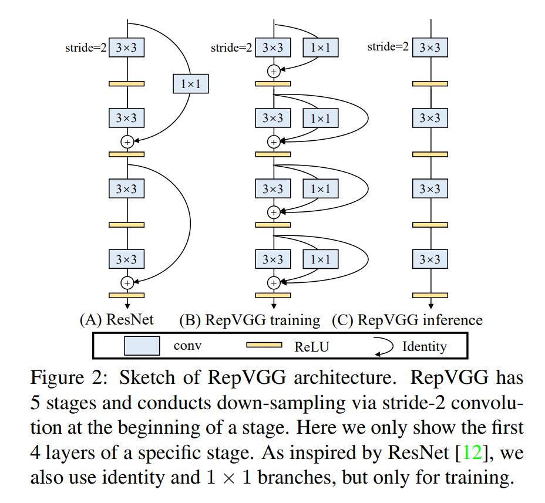
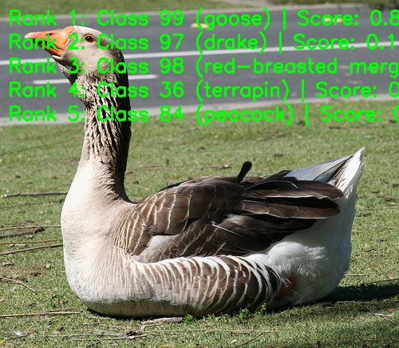

English | [简体中文](./README_cn.md)

# RepVGG Model Description

This directory provides the complete usage guide for the RepVGG sample in Model Zoo, including algorithm overview, model conversion, runtime inference, model file management, and evaluation notes.

## Algorithm Overview

RepVGG is a VGG-style convolutional network family that uses structural re-parameterization. During training it can use multi-branch structures, while during deployment it is converted into a plain stack of `3x3` convolution and ReLU layers for efficient inference.

- **Paper**: [RepVGG: Making VGG-style ConvNets Great Again](https://arxiv.org/abs/2101.03697)
- **Reference Implementation**: [DingXiaoH/RepVGG](https://github.com/DingXiaoH/RepVGG)

### Algorithm Functionality

RepVGG supports the following task:

- ImageNet 1000-class image classification

### Algorithm Features

- **Plain inference structure**: Uses VGG-style convolution stacks after deployment conversion.
- **Structural re-parameterization**: Converts training-time branches into deployment-time convolution layers.
- **Hardware efficiency**: Uses convolution and ReLU operations that are friendly to edge inference.
- **Variant scaling**: Provides `A0`, `A1`, `A2`, `B0`, `B1g2`, and `B1g4` variants.



## Directory Structure

```text
.
|-- conversion
|   |-- RepVGG_A0_config.yaml
|   |-- RepVGG_A1_config.yaml
|   |-- RepVGG_A2_config.yaml
|   |-- RepVGG_B0_config.yaml
|   |-- RepVGG_B1g2_config.yaml
|   |-- RepVGG_B1g4_config.yaml
|   |-- README.md
|   `-- README_cn.md
|-- evaluator
|   |-- README.md
|   `-- README_cn.md
|-- model
|   |-- download.sh
|   |-- README.md
|   `-- README_cn.md
|-- runtime
|   `-- python
|       |-- main.py
|       |-- repvgg.py
|       |-- README.md
|       |-- README_cn.md
|       `-- run.sh
|-- test_data
|   |-- gooze.JPEG
|   |-- ImageNet_1k.json
|   |-- inference.png
|   `-- RepVGG_architecture.png
|-- README.md
`-- README_cn.md
```

## QuickStart

### Python

- Go to [runtime/python/README.md](./runtime/python/README.md) for detailed Python usage.
- For a quick experience:

```bash
cd runtime/python
bash run.sh
```

## Model Conversion

- Prebuilt `.bin` model files are provided through the [model](./model/README.md) directory.
- Conversion guidance is provided in [conversion/README.md](./conversion/README.md).

## Runtime Inference

The maintained inference path for this sample is Python.

- Python runtime guide: [runtime/python/README.md](./runtime/python/README.md)

## Evaluator

Evaluation notes, performance data, and validation summary are provided in [evaluator/README.md](./evaluator/README.md).

## Performance Data

The following table shows the published RepVGG performance on `RDK X5`.

| Model | Size | Classes | Params (M) | Float Top-1 | Quant Top-1 | Latency (ms) | FPS |
| --- | --- | --- | --- | --- | --- | --- | --- |
| RepVGG_B1g2 | 224x224 | 1000 | 41.36 | 77.78 | 68.25 | 9.77 | 109.61 |
| RepVGG_B1g4 | 224x224 | 1000 | 36.12 | 77.58 | 62.75 | 7.58 | 144.39 |
| RepVGG_B0 | 224x224 | 1000 | 14.33 | 75.14 | 60.36 | 3.07 | 410.55 |
| RepVGG_A2 | 224x224 | 1000 | 25.49 | 76.48 | 62.97 | 6.07 | 186.04 |
| RepVGG_A1 | 224x224 | 1000 | 12.78 | 74.46 | 62.78 | 2.67 | 482.20 |
| RepVGG_A0 | 224x224 | 1000 | 8.30 | 72.41 | 51.75 | 1.85 | 757.73 |



## License

Follows the Model Zoo top-level License.
