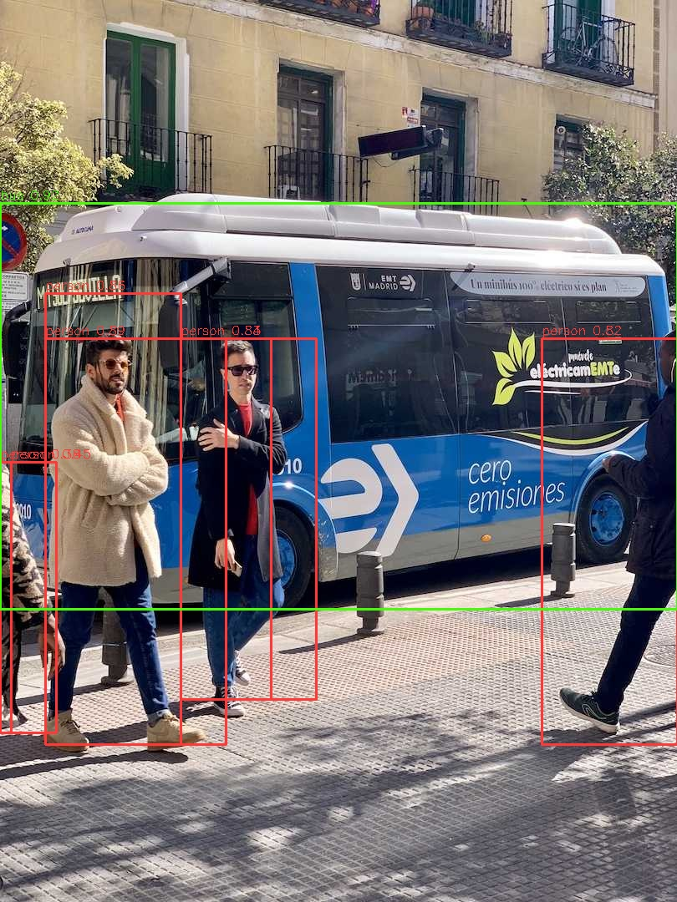

[English](./README.md) | 简体中文

# Ultralytics YOLO 模型说明

本目录提供 Ultralytics YOLO sample 在 Model Zoo 中的完整使用说明，包括算法介绍、模型转换、模型推理、模型文件管理和评估说明。

---

## 算法介绍

Ultralytics YOLO 是一个实时视觉模型家族，涵盖目标检测、实例分割、姿态估计和图像分类。本示例提供了在 RDK S100/S100P 平台上的公开模型部署示例，支持以下模型系列：

- 目标检测：
  `YOLOv5u / YOLOv8 / YOLOv10 / YOLO11 / YOLO12`
- 实例分割：
  `YOLOv8 / YOLO11`
- 姿态估计：
  `YOLOv8 / YOLO11`
- 图像分类：
  `YOLOv8 / YOLO11`

YOLOv5u detect 覆盖公开的 `yolov5nu/su/mu/lu/xu` 模型族。

- **官方实现**：[ultralytics/ultralytics](https://github.com/ultralytics/ultralytics)

### 算法功能

- 目标检测
- 实例分割
- 姿态估计
- 图像分类

### 算法特点

- **多模型族统一入口**：通过 `main.py` 和 `run.sh` 选择模型系列与任务。
- **多任务封装**：检测、分割、姿态、分类分别使用固定 wrapper，避免运行时猜测输出结构。
- **NV12 输入**：runtime 使用 Y/UV 双输入适配 HBM 模型。

### 平台说明

- 目标平台：`RDK S100` / `RDK S100P`
- 运行时后端：`hbm_runtime`
- 推理模型格式：`.hbm`
- 输入格式：`NV12`（Y + UV 两个独立输入张量）

---

## 目录结构

```bash
.
├── conversion/                     # 模型转换流程
├── evaluator/                      # 精度评估与基准测试文档
├── model/                          # 模型文件和下载脚本
│   ├── download_model.sh           # 按变体和任务下载模型
│   └── README.md                   # 模型文件说明
├── runtime/                        # 运行时示例
│   └── python/                     # Python 运行时示例
│       ├── main.py                 # Python 入口脚本
│       ├── yolo_detect.py          # 检测封装（v5u/v8/v11/v12）
│       ├── yolo_seg.py             # 实例分割封装
│       ├── yolo_pose.py            # 姿态估计封装
│       ├── yolo_cls.py             # 图像分类封装
│       ├── yolo_v10detect.py       # 无 NMS 检测封装（v10）
│       ├── run.sh                  # 一键执行脚本
│       └── README.md               # Python 运行时文档
├── test_data/                      # 测试图像和推理结果
├── README.md                       # 英文概览文档
└── README_cn.md                    # 中文概览文档
```

---

## 快速体验

进入 `runtime/python/` 目录，运行脚本即可快速体验。

### Python

```bash
cd runtime/python
bash run.sh detect
```

默认命令会自动下载 `yolo11n_detect_nashe_640x640_nv12.hbm` 模型（如需），并将结果图像保存到 `test_data/`。

详细参数和任务示例请参考 [runtime/python/README.md](./runtime/python/README.md)。

---

## 模型转换

本示例已提供 RDK S100/S100P 的预编译 `.hbm` 模型文件。

- 如仅需推理，可从 [model/README.md](./model/README.md) 下载模型，跳过转换步骤。
- 如需导出 ONNX、准备校准数据或编译模型，请参考 [conversion/README.md](./conversion/README.md)。

---

## 模型推理

本示例目前提供 Python 运行时实现。

### Python 版本

- 使用 `hbm_runtime` 作为推理后端
- 使用统一的 `main.py` 入口，通过 `--task` 参数分发；具体模型家族和尺寸由 `--model-path` 选择
- 每个任务采用 `Config + Model` 封装风格

详细使用方法请参考 [runtime/python/README.md](./runtime/python/README.md)。

---

## 模型评估

`evaluator/` 目录包含基准测试表格、精度参考和支持模型的运行时验证记录。

详情请参考 [evaluator/README.md](./evaluator/README.md)。

---

## 推理结果

Python runtime 的 `run.sh` 覆盖以下 `RDK S100` / `RDK S100P` 文档化模型：

- 检测：
  `YOLOv5u / YOLOv8 / YOLOv10 / YOLO11 / YOLO12`
- 分割：
  `YOLOv8 / YOLO11`
- 姿态：
  `YOLOv8 / YOLO11`
- 分类：
  `YOLOv8 / YOLO11`

本 sample 仅覆盖 Ultralytics YOLO 模型族。

使用默认测试图像时，各任务应输出与图像语义匹配的检测框、分割掩码、姿态关键点或分类结果。详细的基准测试数据和结果检查说明维护在 [evaluator/README.md](./evaluator/README.md) 中。

---

## 推理结果展示

使用默认测试图像，任务会在 `test_data/` 中生成可视化结果。



---

## License

遵循 Model Zoo 顶层 License。
