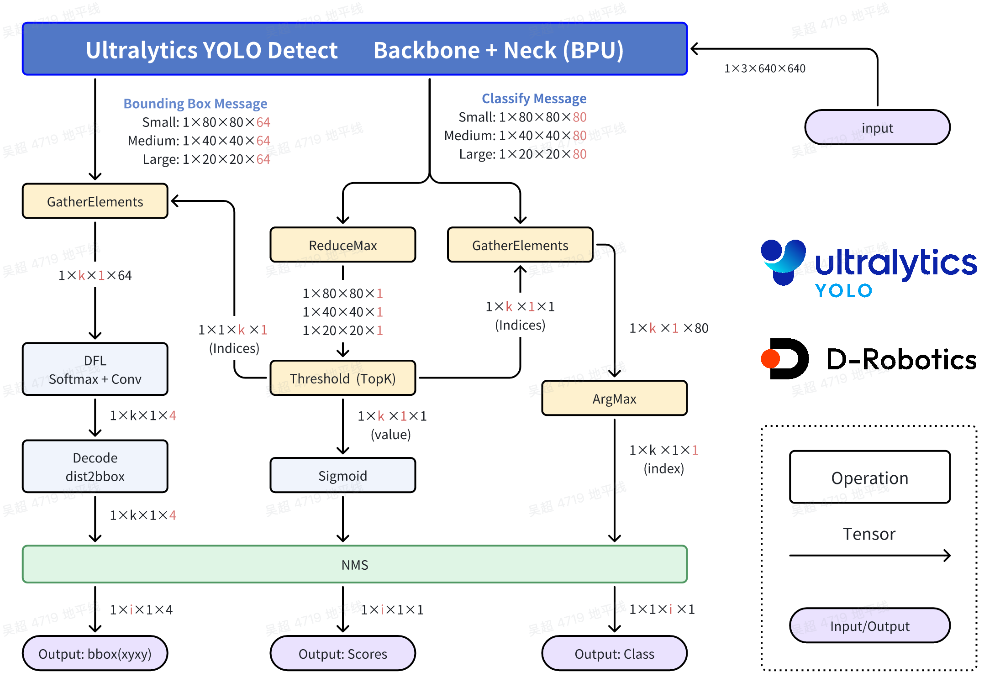
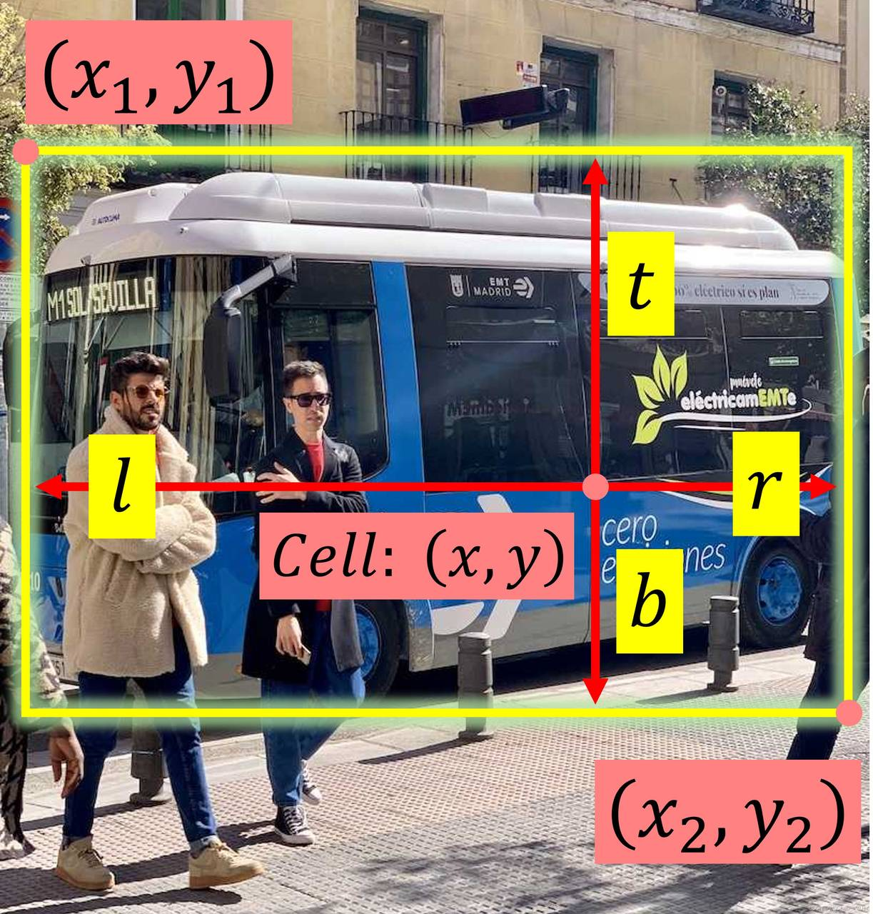
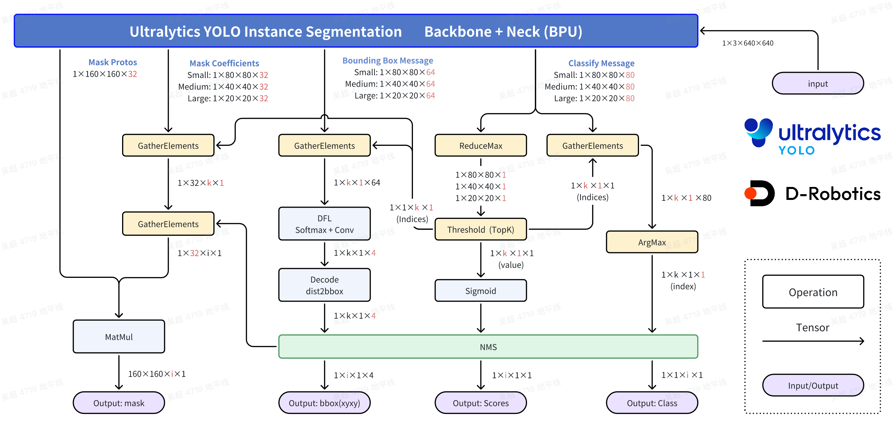
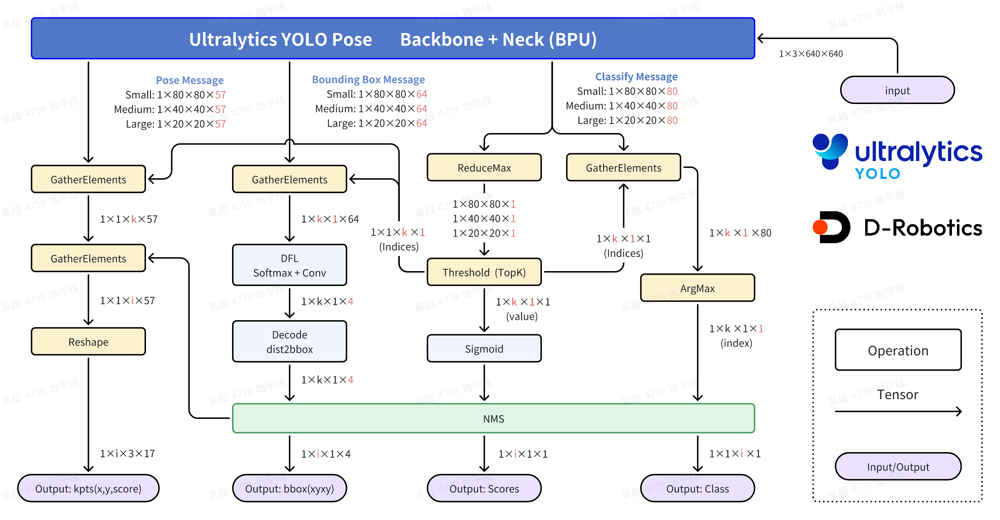

English | [简体中文](./README_cn.md)

# Ultralytics YOLO Model Conversion and Compilation Guide

This directory provides the scripts, resources, and instructions for exporting Ultralytics YOLO models, running quantized compilation, and checking HBM artifacts for RDK S100/S100P BPU deployment.

## Directory Structure

```text
.
├── export_monkey_patch.py          # Ultralytics YOLO ONNX export script
├── mapper.py                       # Prepare calibration data and invoke OpenExplore compiler
├── imgs/                           # Images used by the conversion guide
├── README.md
└── README_cn.md
```

## Compilation Environment

Run model compilation on an x86 Linux host with the RDK S100 OpenExplore Docker environment. Installing the compiler toolchain on the board is not recommended.

Toolchain entry points:

- OE Docker documentation: <https://developer.d-robotics.cc/rdk_doc/rdk_s/Advanced_development/toolchain_development/overview>
- OE toolchain download: <https://toolchain.d-robotics.cc/>

### 1. Install Docker

Install Docker by following the official Docker documentation and verify the installation: <https://docs.docker.com/engine/install/>

```bash
sudo docker --version
sudo docker run --rm hello-world
```

### 2. Download and Load the Offline Image

Visit the [D-Robotics developer documentation](https://developer.d-robotics.cc/rdk_doc/rdk_s/Advanced_development/toolchain_development/overview#docker-%E9%95%9C%E5%83%8F) and download the CPU Docker image for the RDK S100 series.

```bash
sudo docker load -i ai_toolchain_ubuntu_22_s100_xxx.tar
sudo docker images
```

Replace `ai_toolchain_ubuntu_22_s100_xxx.tar` with the actual downloaded file name.

### 3. Start the Container

Use the following command to start the container, mount the current working directory into it, and increase shared memory to avoid memory issues during compilation.

```bash
# Assume the current directory is the rdk_mode_zoo_mc_rdks repository root
sudo docker run -it --rm \
  --network host \
  --shm-size=15g \
  -v "$(pwd)":/workspace \
  --workdir /workspace \
  <docker-image-name> /bin/bash
```

Use `sudo docker images` to find the loaded image name and tag for `<docker-image-name>`.
## Conversion Flow
### High-Performance Computing Process Introduction
#### Object Detection


In the standard processing flow, scores, categories, and xyxy coordinates are fully computed for all 8400 bounding boxes (bbox) to calculate the loss function based on ground truth (GT). However, during deployment, we only need the qualified bboxes, so it's unnecessary to compute all 8400 bboxes completely.

The optimization primarily leverages the monotonicity of the Sigmoid function to perform filtering before calculation. This approach also applies to the DFL and feature decoding stages—filtering first, then computing—which saves substantial computational effort. As a result, the inference time is significantly reduced.

 - Classify part, ReduceMax operation
The ReduceMax operation finds the maximum value along a specific dimension of a Tensor. This operation is used to find the maximum value among the 80 scores of 8,400 Grid Cells. The operation object is the 80 category values of each Grid Cell, operating on the C dimension. Note, this operation provides the maximum value, not the index of the maximum value among the 80 values.
The activation function Sigmoid has monotonicity, so the relative magnitude relationship of the 80 scores before and after the Sigmoid function remains unchanged.
$$Sigmoid(x)=\frac{1}{1+e^{-x}}$$
$$Sigmoid(x_1) > Sigmoid(x_2) \Leftrightarrow x_1 > x_2$$
In summary, the position of the maximum value output directly by the bin model (after dequantization) is the same as the position of the final score's maximum value. The maximum value output by the bin model, after Sigmoid calculation, is the same as the original maximum value from the onnx model.

 - Classify part, Threshold(TopK) operation
This operation is used to find Grid Cells among 8,400 that meet the requirements. The operation object is the 8,400 Grid Cells, operating on the H and W dimensions. If you have read my program, you will notice that I flatten the H and W dimensions later, which is only for convenience in program design and written expression; there is no essential difference.
We assume the score of a certain category for a certain Grid Cell is $x$, the integer data after the activation function is $y$, and the threshold filtering process provides a threshold denoted as $C$. The **necessary and sufficient condition** for this score to be qualified is:

$$y=Sigmoid(x)=\frac{1}{1+e^{-x}}>C$$

From this, we can derive the **necessary and sufficient condition** for this score to be qualified:

$$x > -ln\left(\frac{1}{C}-1\right)$$

This operation will obtain the indices of the qualified Grid Cells and their corresponding maximum values. After Sigmoid calculation, this maximum value becomes the score of the category for this Grid Cell.

 - Classify part, GatherElements operation and ArgMax operation
Using the indices of the qualified Grid Cells obtained from the Threshold(TopK) operation, the GatherElements operation retrieves the qualified Grid Cells, and the ArgMax operation determines which of the 80 categories is the largest, obtaining the category of this qualified Grid Cell.

 - Bounding Box part, GatherElements operation:
Using the indices of qualified grid cells obtained from the Threshold (TopK) operation, the GatherElements operation retrieves these qualified grid cells, resulting in bbox information of shape 1×64×k×1.

 - Bounding Box part, DFL: SoftMax+Conv operation
Each Grid Cell will have 4 numbers to determine the position of this box. The DFL structure provides 16 estimates for the offset of a certain edge of the box based on the anchor position. SoftMax is applied to the 16 estimates, and then a convolution operation is used to calculate the expectation. This is the core design of Anchor Free, meaning each Grid Cell is only responsible for predicting 1 Bounding box. Assuming in the prediction of the offset of a certain edge, these 16 numbers are $ l_p $ or $(t_p, t_p, b_p)$, where $p = 0,1,...,15$, the calculation formula for the offset is:

$$\hat{l} = \sum_{p=0}^{15}{\frac{p·e^{l_p}}{S}}, S =\sum_{p=0}^{15}{e^{l_p}}$$

 - Bounding Box part, Decode: dist2bbox(ltrb2xyxy) operation
This operation decodes the ltrb description of each Bounding Box into an xyxy description. ltrb represents the distance of the left, top, right, and bottom edges relative to the center of the Grid Cell. After restoring the relative position to absolute position and multiplying by the sampling factor of the corresponding feature layer, the xyxy coordinates can be restored. xyxy represents the predicted coordinates of the top-left and bottom-right corners of the Bounding Box.


The input image size is $Size=640$. For the $i$th feature map $(i=1, 2, 3)$ of the Bounding box prediction branch, the corresponding downsampling factor is denoted as $Stride(i)$. In YOLOv8 - Detect, $Stride(1)=8, Stride(2)=16, Stride(3)=32$, corresponding to feature map sizes of $n_i = {Size}/{Stride(i)}$, i.e., sizes of $n_1 = 80, n_2 = 40 ,n_3 = 20$ for three feature maps, totaling $n_1^2+n_2^2+n_3^3=8400$ Grid Cells, responsible for predicting 8,400 Bounding Boxes.
For feature map i, the $x$th row and $y$th column are responsible for predicting the detection box of the corresponding scale Bounding Box, where $x,y \in [0, n_i)\bigcap{Z}$, $Z$ is the set of integers. The DFL structure's Bounding Box detection box description is in ltrb format, while we need the $xyxy$ format. The specific transformation relationship is as follows:

$$x_1 = (x+0.5-l)\times{Stride(i)}$$

$$y_1 = (y+0.5-t)\times{Stride(i)}$$

$$x_2 = (x+0.5+r)\times{Stride(i)}$$

$$y_1 = (y+0.5+b)\times{Stride(i)}$$

The final detection results include category (id), score, and position (xyxy).

#### Instance Segmentation


 - Mask Coefficients part, two GatherElements operations,
used to obtain the Mask Coefficients information of the final qualified Grid Cell, i.e., the 32 coefficients.
These 32 coefficients are linearly combined with the Mask Protos part, or can be considered as a weighted sum, to obtain the Mask information of the target corresponding to this Grid Cell.

#### Pose Estimation


The keypoints of Ultralytics YOLO Pose are based on object detection. The definition of kpt is as follows:
```python
COCO_keypoint_indexes = {
    0: 'nose',
    1: 'left_eye',
    2: 'right_eye',
    3: 'left_ear',
    4: 'right_ear',
    5: 'left_shoulder',
    6: 'right_shoulder',
    7: 'left_elbow',
    8: 'right_elbow',
    9: 'left_wrist',
    10: 'right_wrist',
    11: 'left_hip',
    12: 'right_hip',
    13: 'left_knee',
    14: 'right_knee',
    15: 'left_ankle',
    16: 'right_ankle'
}
```

The object detection part of the Ultralytics YOLO Pose model is consistent with Ultralytics YOLO Detect, with an additional feature map of Channel = 57 corresponding to 17 Key Points, which are the coordinates x, y relative to the feature map's downsampling factor and the score of this point.

After determining through the object detection part that the Key Points at a certain location meet the requirements, multiplying them by the downsampling factor of the corresponding receptive field yields the Key Points coordinates based on the input size.

### 1. Environment Preparation and Model Training

Note: This operation is performed on an x86 machine. It is recommended to use a machine with hardware acceleration, such as a GPU supporting CUDA, where torch.cuda.is_available() is True. It is recommended to use Ubuntu 22.04 with a Python 3.10 environment.

Download the `ultralytics/ultralytics` repository and configure the training environment by following the official Ultralytics documentation.
```bash
git clone https://github.com/ultralytics/ultralytics.git
```

For model training, follow the official Ultralytics documentation. The source `.pt` weight should be trained with the `ultralytics/ultralytics` repository, or you can use the official pretrained weights released by Ultralytics. No program changes are required during training, and the `forward` method should not be modified.

Ultralytics YOLO Official Documentation:

- Quick Start: [https://docs.ultralytics.com/quickstart/](https://docs.ultralytics.com/quickstart/)
- Model Training: [https://docs.ultralytics.com/modes/train/](https://docs.ultralytics.com/modes/train/)

### 2. Export ONNX

Note: This operation is performed on an x86 machine. It is recommended to use Ubuntu 22.04 with a Python 3.10 environment.

Enter the local Ultralytics repository and download the official pretrained weights from Ultralytics, or use a `.pt` weight produced by the Ultralytics training flow. YOLO11n-Detect is used as an example here.
```bash
cd ultralytics
wget https://github.com/ultralytics/assets/releases/download/v8.3.0/yolo11n.pt
```

In the Ultralytics YOLO training environment, run `export_monkey_patch.py` from this directory to export the model. This step depends on `ultralytics.YOLO`, PyTorch, and export dependencies, so it should be run in the training/export environment, not on the board. This script uses the `ultralytics.YOLO` class to load the YOLO `.pt` model, applies a monkey patch to replace the model at the PyTorch level, and then calls `ultralytics.YOLO.export` to export the model. The exported ONNX model is saved in the same directory as the `.pt` model.

```bash
python3 export_monkey_patch.py --pt yolo11n.pt
```

### 3. Model Compilation

Run model compilation in the RDK S100/S100P OpenExplore toolchain environment. The OE Docker offline image is recommended. Do not install or run the compiler toolchain on the board.

Toolchain entry points:

- OE Docker download: [S100 Development Toolchain](https://developer.d-robotics.cc/rdk_doc/rdk_s/Advanced_development/toolchain_development/overview)
- OE toolchain documentation: [https://toolchain.d-robotics.cc/](https://toolchain.d-robotics.cc/)

Run `mapper.py` from this directory in the OpenExplore toolchain environment. Prepare calibration images and the ONNX model before running it. The script automatically prepares calibration data and the compilation YAML configuration. The converted `.hbm` model is saved next to the ONNX model or under `--output-dir`.

```bash
cd samples/vision/ultralytics_yolo/conversion

# RDK S100 (Nash-E)
python3 mapper.py --onnx yolo11n.onnx --cal-images ./cal_images --march nash-e

# RDK S100P (Nash-M)
python3 mapper.py --onnx yolo11n.onnx --cal-images ./cal_images --march nash-m
```

The script exposes common parameters, and the defaults cover most cases.

```bash
$ python3 mapper.py -h
usage: mapper.py [-h] [--cal-images CAL_IMAGES] [--onnx ONNX] [--quantized QUANTIZED] [--jobs JOBS] [--optimize-level OPTIMIZE_LEVEL]
                 [--cal-sample CAL_SAMPLE] [--cal-sample-num CAL_SAMPLE_NUM] [--save-cache SAVE_CACHE] [--cal CAL] [--ws WS]

options:
  -h, --help                        show this help message and exit
  --cal-images CAL_IMAGES           *.jpg, *.png calibration images path, 20 ~ 50 pictures is OK.
  --onnx ONNX                       origin float onnx model path.
  --march MARCH                     S100: nash-e, S100P: nash-m
  --quantized QUANTIZED             int8 first / int16 first
  --jobs JOBS                       model combine jobs.
  --optimize-level OPTIMIZE_LEVEL   O0, O1, O2
  --cal-sample CAL_SAMPLE           sample calibration data or not.
  --cal-sample-num CAL_SAMPLE_NUM   num of sample calibration data.
  --save-cache SAVE_CACHE           remove bpu output files or not.
  --cal CAL                         calibration_data_temporary_folder
  --ws WS                           temporary workspace
```

Recommended `.hbm` file names:

- S100: `*_nashe_*_nv12.hbm`
- S100P: `*_nashm_*_nv12.hbm`

Place model files under `model/nash-e/` or `model/nash-m/` in this sample so that `runtime/python/run.sh` and `runtime/python/main.py` can use them directly.
## Input and Output Protocol

### Input Protocol

The Ultralytics YOLO runtime uses NV12 input and always expects two input tensors:

- `input[0]`: Y plane
- `input[1]`: UV plane

Converted models must keep this input protocol.

### Output Protocol

The Python runtime parses outputs by fixed indices :

- Detection: `[cls, box] * 3`
- YOLOv10 Detection: `[bbox, score, class_id]`
- Segmentation: `[cls, box, mask_coeff] * 3 + proto`
- Pose: `[cls, box, keypoints] * 3`
- Classification: a single classification output tensor

The current runtime covers the following model families and task combinations:

| Model Family | Detection | Segmentation | Pose | Classification |
| :--- | :---: | :---: | :---: | :---: |
| YOLOv5u | Supported | Not supported | Not supported | Not supported |
| YOLOv8 | Supported | Supported | Supported | Supported |
| YOLOv10 | Supported | Not supported | Not supported | Not supported |
| YOLO11 | Supported | Supported | Supported | Supported |
| YOLO12 | Supported | Not supported | Not supported | Not supported |

See `runtime/python/yolo_*.py` for the post-processing implementation.

## Check Compilation Results

```bash
hrt_model_exec model_info --model_file yolo11n_detect_nashm_640x640_nv12.hbm
hrt_model_exec perf --model_file yolo11n_detect_nashm_640x640_nv12.hbm --thread_num 1
```

## FAQ

- **Permission errors**: If copied files have unexpected ownership on the host, check file owners or run `sudo chown -R`.
- **Memory or IPC errors**: Add `--shm-size=15g` when starting the Docker container.
- **Unsupported optimization level**: Use `O0`, `O1`, or `O2` if `O3` is not supported on Nash.

## License

Tools in this directory are licensed under the [Apache 2.0 License](../../../../LICENSE).
