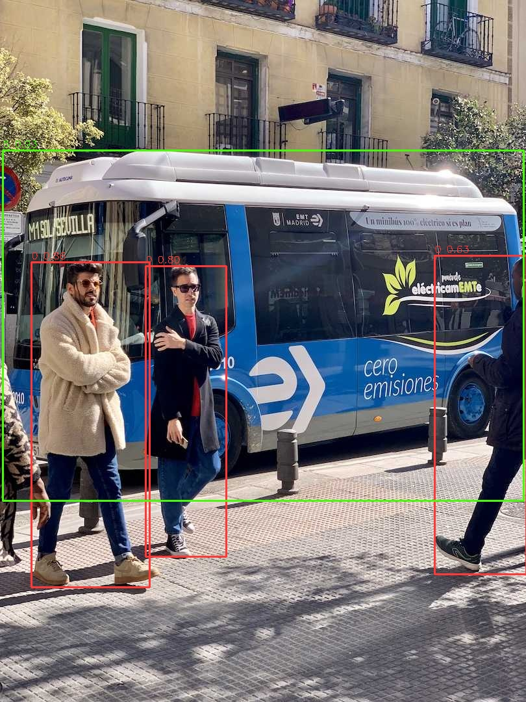

[English](./README.md) | 简体中文

# YOLO26 模型说明

本目录提供 YOLO26 sample 在 Model Zoo 中的完整使用说明，包括算法介绍、模型转换、模型推理、模型文件管理和评估说明。

---

## 算法介绍

YOLO26 是 Ultralytics 推出的实时视觉模型系列。本示例提供了在 RDK S100/S100P 平台上的部署示例，支持以下任务：

- 目标检测
- 实例分割
- 姿态估计
- 旋转目标检测
- 图像分类

- **官方实现**：[ultralytics/ultralytics](https://github.com/ultralytics/ultralytics)

### 算法功能

- 目标检测
- 实例分割
- 姿态估计
- 旋转目标检测
- 图像分类

### 算法特点

- **多任务统一入口**：`main.py` 通过 `--task` 选择任务。
- **固定 tensor 协议**：各任务 wrapper 按固定输入输出索引解析，不做输出结构猜测。
- **NV12 输入**：runtime 使用 Y/UV 双输入适配 HBM 模型。

### 平台说明

- 目标平台：`RDK S100` / `RDK S100P`
- 运行时后端：`hbm_runtime`
- 推理模型格式：`.hbm`
- 输入格式：`NV12`（Y + UV 两个独立输入张量）

---

## 目录结构

```bash
.
├── conversion/                     # 模型转换流程
├── evaluator/                      # 精度评估与基准测试
├── model/                          # 模型文件和下载脚本
│   ├── download_model.sh           # 下载预编译模型
│   └── README.md                   # 模型文件说明
├── runtime/                        # 运行时示例
│   └── python/                     # Python 推理示例
│       ├── main.py                 # Python 入口脚本
│       ├── yolo26_det.py           # 目标检测封装
│       ├── yolo26_seg.py           # 实例分割封装
│       ├── yolo26_pose.py          # 姿态估计封装
│       ├── yolo26_obb.py           # 旋转框检测封装
│       ├── yolo26_cls.py           # 图像分类封装
│       ├── run.sh                  # 一键执行脚本
│       └── README.md               # 运行时文档
├── test_data/                      # 测试图像和推理结果
└── README.md                       # 当前概览文档
```

---

## 快速体验

进入 `runtime/python/` 目录，运行一键脚本即可快速体验。

### Python

```bash
cd runtime/python
bash run.sh detect
```

脚本会自动下载默认的 `yolo26n` 检测模型（如需），并将输出图像保存到 `test_data/`。

详细参数和任务示例请参考 [runtime/python/README.md](./runtime/python/README.md)。

---

## 模型转换

本示例已提供 RDK S100/S100P 的预编译 `.hbm` 模型文件。

- 如仅需推理，可从 [model/README.md](./model/README.md) 下载模型，跳过转换步骤。
- 如需了解或自定义转换流程，请参考 [conversion/README.md](./conversion/README.md)。

---

## 模型推理

本示例目前提供 Python 运行时实现。

### Python 版本

- 使用 `hbm_runtime` 作为推理后端
- 采用统一的 `Config + Model` 封装风格，支持所有任务
- 支持从 `main.py` 零参数默认执行

详细使用方法请参考 [runtime/python/README.md](./runtime/python/README.md)。

---

## 模型评估

`evaluator/` 目录用于任务级精度和结果导出验证。详情请参考 [evaluator/README.md](./evaluator/README.md)。

---

## 推理结果

Python runtime 的 `run.sh` 覆盖以下 `RDK S100` / `RDK S100P` `.hbm` 模型：

- `detect`：`n`
- `seg`：`n`
- `pose`：`n`
- `obb`：`n`
- `cls`：`n`

使用默认测试图像时，各任务应输出与图像语义匹配的检测框、分割掩码、姿态关键点、旋转框或分类结果。详细的基准测试数据和结果检查说明维护在 [evaluator/README.md](./evaluator/README.md) 中。

---

## 推理结果展示

使用默认测试图像，任务会在 `test_data/` 中生成可视化结果。



---

## License

遵循 Model Zoo 顶层 License。
